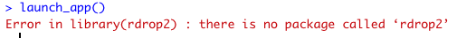
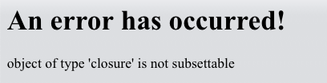
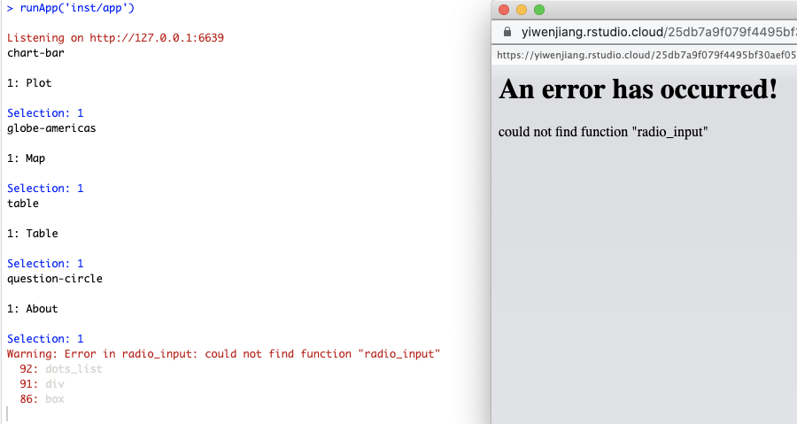
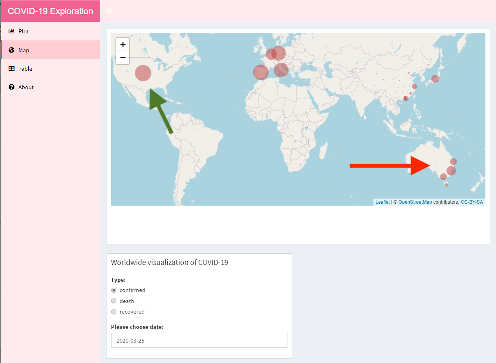

R packages are collections of functions and datasets developed by the developers. They increase the power of R by improving existing base R functionalities, or by adding new ones. This blog post is a peer review of the colleague’s R package and mainly focus on providing useful feedback and what I have learned from their package.

# `phyllispkg` Package Overview

This blog reviews a package which is called `phyllispkg`, the creator of this package is Peimin Lin. The `phyllispkg` package can be found via [Github](https://github.com/etc5523-2020/r-package-assessment-Phyllis-Lin) or install it by using the following code:

```
devtools::install_github("etc5523-2020/r-package-assessment-Phyllis-Lin")
```

This package aims to provide COVID-19 shiny app. It also provides relevant functions which are used to in this shiny app’s UI and Sever, also the relevant datasets of COVID-19.

There are four functions inside the package which are:

- `launch_app()`: Launch the shiny app inside the package
- `leaf_output()`: Builds leaflet map
- `radio_input()`: Builds a radio button to select the type of cases
- `menu()`: Add menu and icon in the sidebar menu

# What did I think this package would do? Did it do it?

What I expected of this `phyllispkg` package would do includes the following aspects. It can run the COVID-19 shiny app appropriately and all the plots and tables in the app are working well. The functions in the package can be used to produce this shiny app and also used in another situation. Full documentation to explain how to use the functions and datasets in `phyllispkg` package.

<center>
```{r launch-app-error, echo=FALSE, out.width = '80%', fig.cap="When using the launch_app() function from the `phyllispkg` package, get errors to required install other packages", fig.align='center'}

```

```{r shiny-error, echo=FALSE, out.width = '60%', fig.cap="Error message when launching the shiny app", fig.align='center'}

```
</center>

First, when trying to use `launch_app()` function to launch the shiny app, there are some error messages (Part of the messages was showing in Figure \@ref(fig:launch-app-error)) came out, which are required to install other packages before running this shiny app. After installing all the relevant packages based on the error message and try to launch the app again. There was a new error came out (Refer to Figure \@ref(fig:shiny-error)), we can assess that the shiny app inside `phyllispkg` package cannot run properly.

After going through the shiny app `R.script`, all the functions from this package are appropriately used in COVID-19 shiny app. Those functions are also providing multiple arguments so that those functions can be used in other scenarios. For example, the `menu()` function provides `id`, `tab` and `name` arguments, users can choose the different icons and add the sidebar menu to their own shiny app based on their needs.

By using the help function in R to check documentations of all the datasets and functions inside `phyllispkg` package. Figure 3 shows one of the documentations of the datasets. All the datasets and functions are documented well, users are able to clearly understands what the functions do and what arguments inside the function represents. Users can use those functions and datasets in their own report.

# Points need to improve
## Are the improvements that could be made to the code? 

The overall codes inside the package are working well, but there are still the following points that can be improved.

```
radio_input  <- function(inputId, label, choices) {
  radioButtons(inputId,
               label = label,
               choices = c("confirmed", "death", "recovered"), 
               selected = "confirmed"
  )
}
```

As shown in the code above, for the function of `radio_input()`, the `choice` argument cannot be changed by users because it has been pre-defined to "confirmed", "death" and "recovered". If we assume that the arguments of choices can be changed, there will raise another issue. Because the `selected` argument inside the function cannot be modified, which means that if the users use another data and there is no so-called “confirmed” variable in that data, the function cannot work properly.

```
menu <- function(id, tab, name){
  menuItem(id, tabName = tab, icon = icon(name))
}
```

Also the `menu()` function (showing in the above chunk), it gives three arguments which are same as the arguments of ` menuItem()` function, that is pointless for creating this function because users still have to set the id of the menu, menu name and its icon.

## Are there improvements that could be made to the shiny app inside the package? 

```{r run-error, echo=FALSE, out.width = '100%', fig.cap="Error message when run the shiny app", fig.align='center'}

```

First of all, as mentioned above the `launch_app()` function from `phyllispkg` package does not work, and if we try to run the shiny app directly, it still comes out with an error (Refer to Figure \@ref(fig:run-error)).

After going through all the `R.script` which are related to run this shiny app, there are few points that could be improved:

1. Because there are separate files required to run the shiny app, it should be better to add `shinyApp(ui = ui, server = server)` under the `global.R`, that users can know how to run the shiny app.
2. In both of the `server.R` and `ui.R` of this shiny app, it used the datasets and functions from the `phyllispkg` package to create the plots, tables and interactive input. However, in the `global.R`, there is no `library(phyllispkg)`. That cause when running the shiny app it cannot find the datasets and functions been used.

```{r map, echo=FALSE, out.width = '100%', fig.cap="Map tab in the shiny app", fig.align='center'}

```

According to the shiny app inside the package, we can observe that the data used to make the map does not seem to be consistent. As shown in Figure \@ref(fig:map), as the green arrow points out that the number in the United States are counted as a whole, but the red arrow points out that in the Australia numbers are counted for each state. It may mislead the users when they use this map or data to make a comparison. It is also worth noting that there are no comments or notes under each tab of "Plot", "Map", and "Table” which are used tell the users how to change the corresponding inputs, and what the outputs of plots or tables are. The users may be confused by the inputs and outputs if they do not understand the data very well.

## Is the documentation sufficient to get started?

All the documentations for the datasets inside the package are sufficient, such as the description of what the data is, what each of the variables in each dataset represents for and the source of the datasets.

Although most of the functions are provided with what of each of the argument does, it still gets confused to understand how to use it. For example, `menu()` function can only be used in a shiny app, if the users use this in a markdown file they may not understand the what this function does and what the output is. It is better to mention under what situation we can use this function and provide at least one example in the documentation for each of the function.

# What I have learned from reviewing this package? 

It is difficult to make an R package individually because there are some many aspects has to concerned such as clean the datasets, create functions and test all the functions working well. By reviewing the `phyllispkg` package, it can be seen that the contents of this package still meet the basic requirements of a package, function been tested, and all the datasets and functions are documented well. Those documentations explain and introduce how this package works and how to use it.

What surprised me and the aspect I liked is that, like other commonly used R packages, the creator also made the logo for this package. This made me feel very professional when I saw the GitHub page of this package for the first time.


# Appendix


## Package Review

- **Briefly describe any working relationship you have (had) with the package authors.**

- [x] As the reviewer I confirm that there are no [conflicts of interest](https://devguide.ropensci.org/policies.html#coi) for me to review this work.

#### Documentation

The package includes all the following forms of documentation:

- [x] **Installation instructions:** for the package is found in README

- [x] **Vignette(s)** demonstrating major functionality that runs successfully locally

- [x] **Function Documentation:** for all exported functions in R help

- [ ] **Examples** for all exported functions in R Help that run successfully locally

#### Functionality

- [x] **Installation:** Installation succeeds as documented.

- [ ] **Functionality:** Any functional claims of the software been confirmed.

- [ ] **Automated tests:** Unit tests cover essential functions of the package and a reasonable range of inputs and conditions. All tests pass on the local machine.

### Review Comments

- All the functions inside this package do not provide any examples
- The `launch_app()` function inside this package can not run properly
- There is only one test which is a test for the `menu()` function, other functions have not been tested.

# Acknowledgement

Thanks for _Hugo_ to provide framework for building websites. Package used to create this blog is @knitr

# Reference


